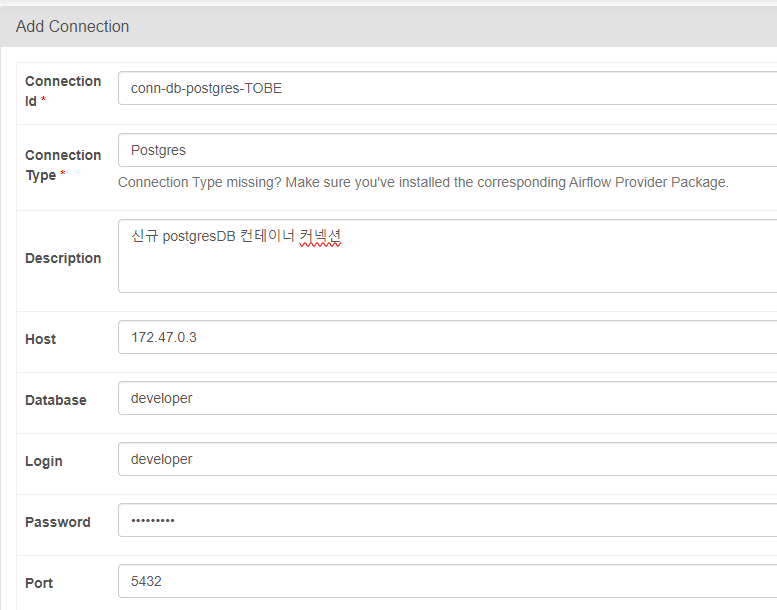
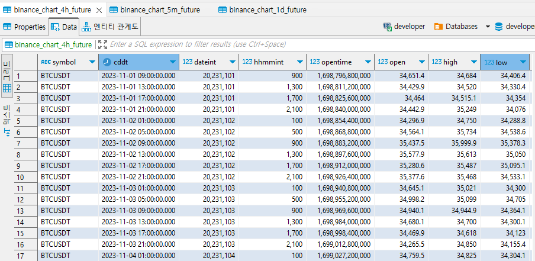

# binance-data
Create &amp; Update binance crypto currency data

## 수집 가능한 interval

> ['1m', '3m', '5m', '15m' '30m', '1h', '2h', '4h', '6h', '8h', '12h', '1d', '1w']

## REQUIREMENTS

- Docker
- Python 3.11.6
- DBeaver (dbeaver.io 에 접속해서 별도 프로그램 설치 권장)

## INSTALLATION

1. 터미널에서 clone한 폴더 경로로 이동한 뒤, 아래 명령어를 실행합니다.
> docker-compose build

이미지 이름 변경을 원하실경우, docker-compose.yaml도 같이 수정해주셔야 합니다.

2. 아래 명령어를 실행하여 컨테이너를 만들고 실행시킵니다.
> docker-compose up

3. https://localhost:8080으로 접속하여 airflow web UI를 불러옵니다.

4. WebUI의 Admin 탭 > Connections로 들어가서 DB 연결정보를 아래처럼 추가해줍니다.

5. dags_collect_binance_data를 실행시키면 데이터 수집 및 DB 적재가 진행됩니다.

6. 수집을 완료하면 DBeaver 등의 Client를 통하여 Postgres DB 내부 데이터를 직접 확인 가능합니다.

## 프로젝트 진행 상황 (hongcana)

1. docker 설정

- Dockerfile 생성 및 자체 이미지 생성( image name : binance_data:1.0.0 ) 
- docker-compose.yaml custom network 구성 (Hook을 사용하기 위함)
- docker-compose.yaml services 추가 구성 (network 등)

2. airflow 설정

- postgres 연결용 Connections 정보 추가
- airflow DAG 작성에 필요한 로컬 파이썬 가상환경 library 셋업

3. airflow DAG 작성

- 로컬 환경 개발을 위한 .env 파일 추가
- dags_collect_binance_data.py 개발
- updater_binance.py에 postgres Hook을 이용한 코드 업데이트